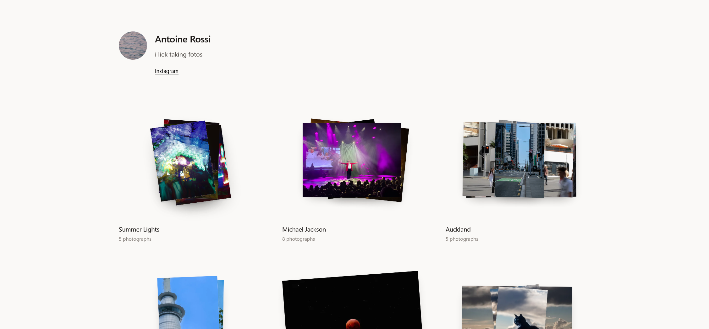
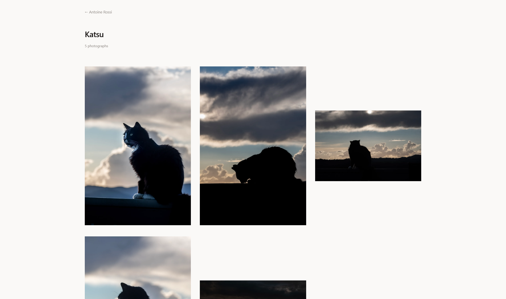
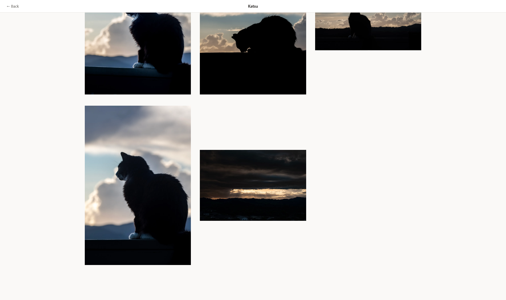
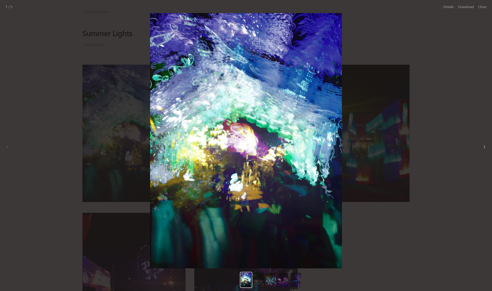
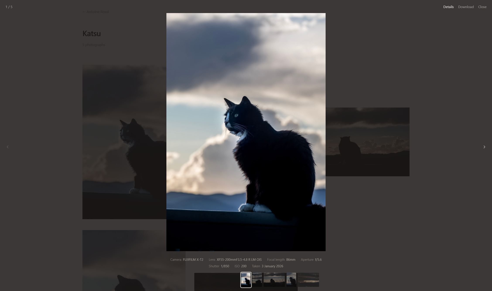
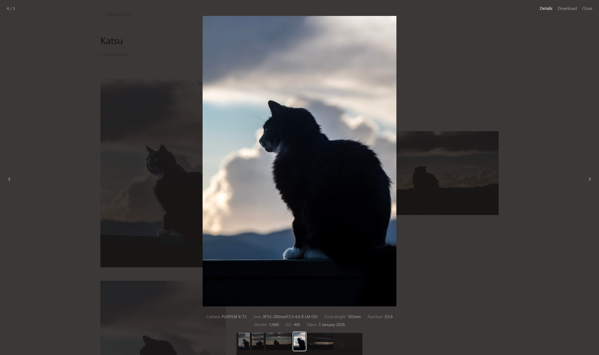
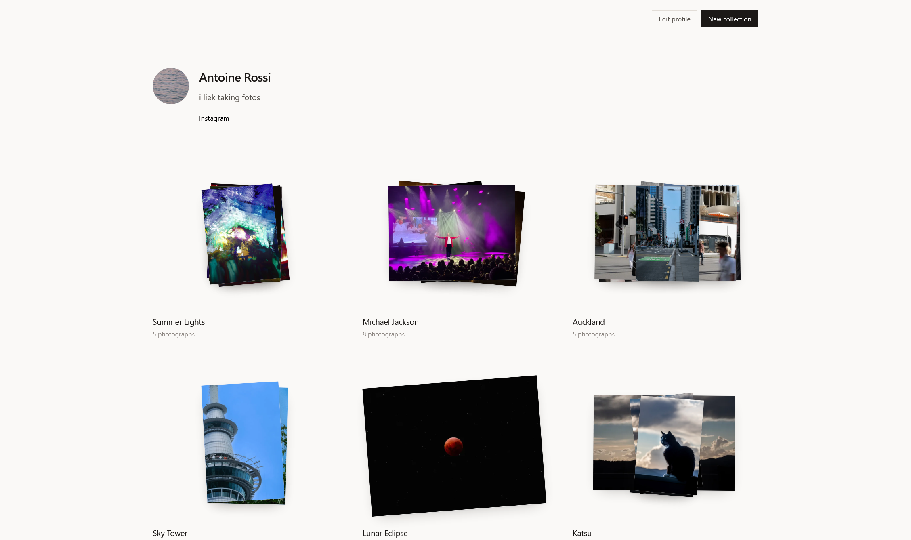
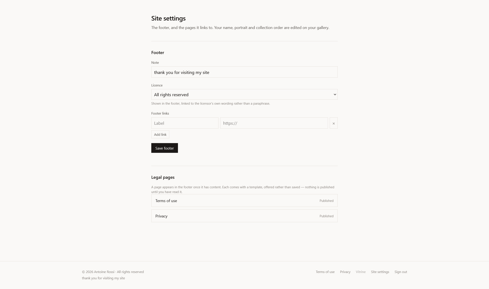

<div align="center">

# Vitrine

**A self-hosted photo gallery for a single photographer. Built with SvelteKit, Svelte 5, and SQLite.**

_A vitrine is the glass case a gallery shows its work in._

You log in, upload photographs into collections and choose what's public. Visitors get your page — a short about, a portrait, your links — with each collection rendered as a stack of prints that tilts in 3D under the cursor and animates into a grid when opened. Open source, MIT licensed, and designed to run on one small server with **one directory to back up**.

<br>

 &nbsp; 

</div>

## Features

- **Collections as stacks** — each collection is a scattered pile of prints that tilts in 3D and drifts toward the cursor as you move across it
- **Animated navigation** — opening a collection moves its photographs into the grid across a real URL change, so the collection page is genuinely shareable, not a modal pretending to be one
- **A proper viewer** — arrow keys, a filmstrip, click-to-zoom and pan, each photo at its own deep-linkable URL
- **Visibility control** — public, unlisted or private per collection, plus an optional password for sending a client a link without giving them an account
- **Optional downloads** — per photo or the whole collection as a streamed ZIP, off by default and enabled per collection
- **Metadata you choose** — camera, lens, aperture and the rest are shown only if you opt in; location is withheld unless you deliberately enable it, and served images carry no EXIF at all
- **Ordered by when you shot it** — collections sort by the capture date of their photographs, not by upload date, so an old series scanned last week doesn't jump to the top
- **Inline administration** — edit your profile, create collections and drop files anywhere on the page; there is no separate admin panel to navigate to
- **No native dependencies** — `npm install` needs no compiler, and the whole app is one Node process plus one SQLite file

## Quick start

Requires [Docker](https://docs.docker.com/get-docker/).

```sh
git clone https://github.com/Antoinenz/vitrine.git
cd vitrine
```

Open `docker-compose.yml` and set three things:

```yaml
ORIGIN: http://localhost:3000 # the URL you'll actually visit
ADMIN_EMAIL: you@example.com # your account, created on first boot
ADMIN_PASSWORD: choose-something-long # 12+ characters
```

Then:

```sh
docker compose up -d
```

Your gallery is at `http://localhost:3000`.

### Setting up your gallery

1. Sign in with the email and password you just set
2. Choose a new password when prompted — the bootstrap one stops working
3. **Edit profile** to add your name, portrait, a line about yourself and your links
4. **New collection**, then drag a folder of photographs anywhere onto the page
5. Set the collection to **public** when you're happy with it


New collections start private, so nothing is published until you say so.

### Putting it on the internet

`ORIGIN` must be the address visitors actually type. Running behind a domain, a reverse proxy or a Cloudflare Tunnel, set it to the public URL:

```yaml
ORIGIN: https://gallery.example.com
```

Getting this wrong is the single most common setup problem — the gallery browses perfectly while signing in fails with a bare `403`. [Configuration → running behind a proxy or tunnel](docs/CONFIGURATION.md#running-behind-a-proxy-or-tunnel) covers it.

## Documentation

| Guide                                  |                                                                         |
| -------------------------------------- | ----------------------------------------------------------------------- |
| [Configuration](docs/CONFIGURATION.md) | Every setting, proxies and tunnels, backups, upgrading, troubleshooting |
| [Development](docs/DEVELOPMENT.md)     | Running from source, commands, tests, migrations, contributing          |
| [Architecture](docs/ARCHITECTURE.md)   | Why the pieces are built the way they are                               |
| [Roadmap](docs/ROADMAP.md)             | What works, what's rough, what's coming, what it won't become           |
| [TODO](docs/TODO.md)                   | The working list of what to pick up next                                |

## Status

**Early development.** It works end to end — sign in, upload, publish, browse, download — and has been run in anger by exactly one person, its author. Back up `DATA_DIR` and expect rough edges, particularly in uploading and collection management. The [roadmap](docs/ROADMAP.md#where-it-is-today) is honest about which parts are solid and which aren't.

## Screenshots

<details>
<summary>More screenshots</summary>
<br>

 &nbsp; 

 &nbsp; 

 &nbsp; 

 &nbsp; 

 &nbsp; 

 &nbsp; 

(Screenshots taken on a pre-release version of Vitrine)

</details>

## License

[MIT](LICENSE) © Antoine Rossi

Animation uses [GSAP](https://gsap.com), which is free for commercial and open source use under its own [standard license](https://gsap.com/community/standard-license/) — free, but not an OSI-approved license, which is worth knowing if you fork this.
