<div align="center">

# Vitrine

**A self-hosted photo gallery for a single photographer. Built with SvelteKit, Svelte 5, and SQLite.**

_A vitrine is the glass case a gallery shows its work in._

You log in, upload photographs into collections and choose what's public. Visitors get your page — a short about, a portrait, your links — with each collection rendered as a stack of prints that tilts in 3D under the cursor and animates into a grid when opened. Open source, MIT licensed, and designed to run on one small server with **one directory to back up**.

<br>

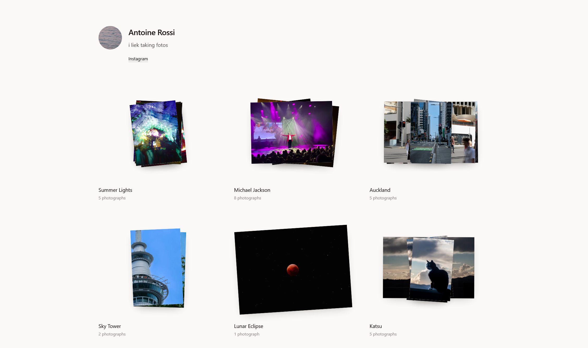 &nbsp; 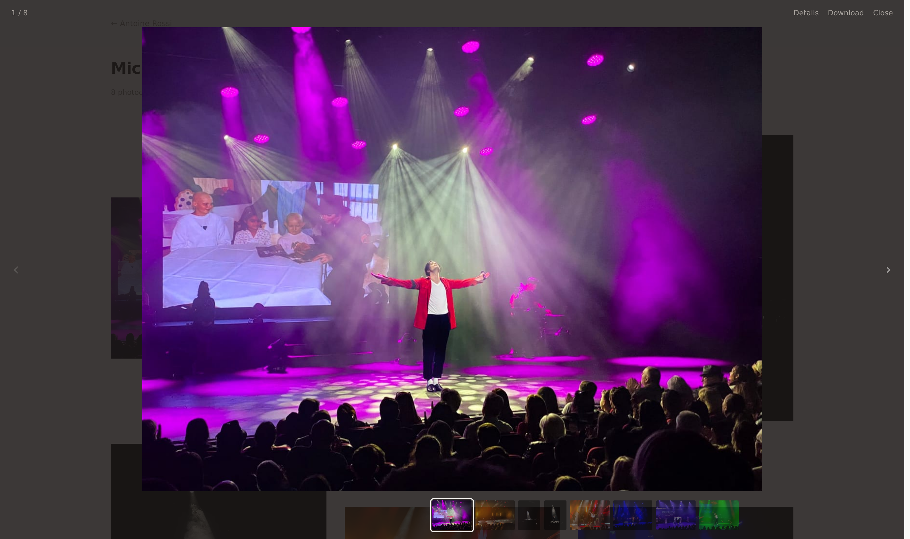

</div>

## Features

- **Collections as stacks** — each collection is a scattered pile of prints that tilts in 3D and drifts toward the cursor as you move across it
- **Animated navigation** — opening a collection moves its photographs into the grid across a real URL change, so the collection page is genuinely shareable, not a modal pretending to be one
- **A proper viewer** — arrow keys, a filmstrip, click-to-zoom and pan, each photo at its own deep-linkable URL
- **Visibility control** — public, unlisted or private per collection, plus an optional password for sending a client a link without giving them an account
- **Optional downloads** — per photo or the whole collection as a streamed ZIP, off by default and enabled per collection
- **Metadata you choose** — camera, lens, aperture and the rest are shown only if you opt in; location is withheld unless you deliberately enable it, and served images carry no EXIF at all
- **Ordered by when you shot it** — collections sort by the capture date of their photographs, not by upload date, so an old series scanned last week doesn't jump to the top
- **Inline administration** — edit your profile, create collections and drop files anywhere on the page; there is no separate admin panel to navigate to
- **No native dependencies** — `npm install` needs no compiler, and the whole app is one Node process plus one SQLite file

## Status: usable, still pre-1.0

The gallery works end to end — sign in, upload, publish, browse, download. It has not yet been run in anger by anyone but its author, so treat it as early software: back up `DATA_DIR`, and expect rough edges.

| Area                                        | State              |
| ------------------------------------------- | ------------------ |
| Upload, collections, visibility, profile    | ✅                 |
| Public pages, stacks, collection grid       | ✅                 |
| Stack → grid transition, 3D hover           | ✅                 |
| Photo viewer — keys, filmstrip, zoom, swipe | ✅                 |
| Downloads, collection ZIP, metadata control | ✅                 |
| Drag-to-reorder, sitemap, link previews     | ✅                 |
| Multi-artist, S3 storage, video             | ⬜ Not planned yet |

## Installation

Requires [Docker](https://docs.docker.com/get-docker/).

```sh
git clone https://github.com/Antoinenz/vitrine.git
cd vitrine
```

Edit `docker-compose.yml` to set `ADMIN_EMAIL`, `ADMIN_PASSWORD` and `ORIGIN`, then:

```sh
docker compose up -d
```

## Setup

1. Open the app at `http://localhost:3000`
2. Sign in with the `ADMIN_EMAIL` and `ADMIN_PASSWORD` you set — on first boot Vitrine creates your account from those variables
3. Choose a new password when prompted, so the bootstrap credential doesn't stay valid
4. Create a collection, drag a folder of photographs onto the page, and set it to public when you're ready

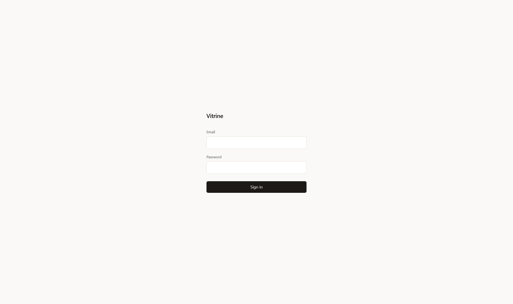

## Configuration

Every option, with its default:

| Variable             | Default      | Notes                                                                                                                                    |
| -------------------- | ------------ | ---------------------------------------------------------------------------------------------------------------------------------------- |
| `ORIGIN`             | —            | The URL visitors actually use, including scheme and port. Required in production; form submissions from a different origin are rejected. |
| `DATA_DIR`           | `./data`     | Database, originals and renditions. The whole backup surface.                                                                            |
| `DATABASE_URL`       | `vitrine.db` | Relative paths resolve inside `DATA_DIR`.                                                                                                |
| `BODY_SIZE_LIMIT`    | `512M`       | See the warning below.                                                                                                                   |
| `MAX_UPLOAD_MB`      | `100`        | Largest single file accepted.                                                                                                            |
| `IMAGE_FORMATS`      | `avif,webp`  | Rendition formats, most-preferred first.                                                                                                 |
| `WORKER_CONCURRENCY` | `2`          | Photos processed in parallel.                                                                                                            |
| `SESSION_TTL_DAYS`   | `30`         | How long a login stays valid.                                                                                                            |
| `ADMIN_EMAIL`        | —            | Used only on first boot, while no account exists.                                                                                        |
| `ADMIN_PASSWORD`     | —            | Same. Must be 12+ characters in production.                                                                                              |
| `PORT`               | `3000`       |                                                                                                                                          |

**About `BODY_SIZE_LIMIT`:** the underlying server defaults this to 512kb, which rejects every realistic photo upload with an opaque `413`. The Docker image sets it to `512M` already, so you only need to think about it if you run outside Docker — or if you put a reverse proxy in front, which needs its own limit raised to match:

```nginx
client_max_body_size 512m;
```

Caddy has no request body limit by default and needs nothing.

**On reaching your gallery at more than one address:** `ORIGIN` is a single value, and SvelteKit rejects form submissions whose `Origin` header doesn't match it — so browsing works from anywhere, but signing in only works at the configured address. SvelteKit's `csrf.trustedOrigins` allow-list would solve it, but that is **build-time** configuration, so it can't be set through an environment variable on a prebuilt image. Pick the address you'll administer from and set `ORIGIN` to it.

**Behind a reverse proxy or a tunnel** (Cloudflare Tunnel, nginx, Caddy), `ORIGIN` must be the **public** URL your browser shows, not the address the proxy forwards to:

```sh
# The gallery listens on localhost:3000, but visitors arrive at:
ORIGIN=https://gallery.example.com
```

Set it to the internal address and browsing still works perfectly — every page loads, images and all — while signing in fails with a bare `403 Forbidden` in the network tab and no message on the page. The origin check runs before anything that could explain itself. If sign-in 403s, this is almost always why.

**On low-powered hardware** (a Raspberry Pi, a 1 vCPU VPS), set `IMAGE_FORMATS=webp`. AVIF compresses better but costs seconds of CPU per rendition, which is painful when you drop 200 photographs at once.

### Backups

Stop the container and copy `DATA_DIR`. That's everything — database, originals and renditions. There is no external service and no second datastore.

### Upgrading

Pull the new image and restart. Migrations apply automatically at startup.

## Development

**Prerequisites:** Node 24+ (pinned in `.nvmrc`)

```sh
nvm use
npm install
cp .env.example .env    # then edit ADMIN_EMAIL / ADMIN_PASSWORD
npm run dev
```

| Command               |                                                 |
| --------------------- | ----------------------------------------------- |
| `npm run dev`         | Dev server with hot reload                      |
| `npm run build`       | Production build                                |
| `npm run check`       | Typecheck                                       |
| `npm run lint`        | Prettier + ESLint                               |
| `npm run format`      | Apply formatting                                |
| `npm run db:generate` | Generate migration SQL after editing the schema |

```sh
npm run test:unit -- --run   # unit tests
npm run test:e2e             # browser tests (builds and serves automatically)
```

The unit suite pins `DATA_DIR` to a scratch directory itself, so running it can never touch your development data.

Migrations are **generated** by drizzle-kit but **applied by the app** at startup, so `db:migrate` isn't part of the normal workflow — edit `src/lib/server/db/schema.ts`, run `npm run db:generate`, and restart.

## Architecture notes

A few decisions that aren't obvious from the code:

**No native SQLite dependency.** The database layer runs on Node's built-in `node:sqlite` rather than `better-sqlite3`. The native package's prebuilt binaries need a newer glibc than Debian 12 or `node:24-bookworm` ship, and falling back to a source build requires a C++ toolchain — unreasonable friction for an app whose whole premise is that you can install it yourself. A small shim (`src/lib/server/db/sqlite-shim.ts`) adapts the built-in module to the interface Drizzle's synchronous driver expects, keeping transactions and savepoints with zero native dependencies. This is why `npm install` needs no compiler.

**Ordering uses fractional keys.** Dragging a photo to a new position rewrites one row rather than renumbering the whole collection.

**The processing queue lives in the database.** `photos.status` _is_ the queue, so a crash mid-encode doesn't lose work — anything stranded is picked up again at startup. Requiring Redis to resize images would be the heaviest operational cost in an app meant to run on a cheap VPS.

**Metadata is an allow-list.** A field is published only by being named, so adding a newly extracted EXIF tag can't leak it by default. Served renditions are re-encoded and carry no metadata at all, whatever the display settings say.

**Session lifetime is sent as a duration.** The cookie carries `Max-Age`, not an absolute `Expires`, so a server whose clock has drifted can't hand the browser a session that is already dead on arrival — a failure that otherwise looks like a successful login that silently does nothing.

## Screenshots

<details>
<summary>More screenshots</summary>
<br>

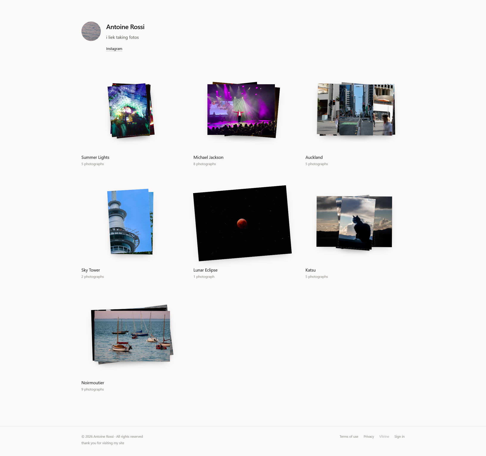 &nbsp; 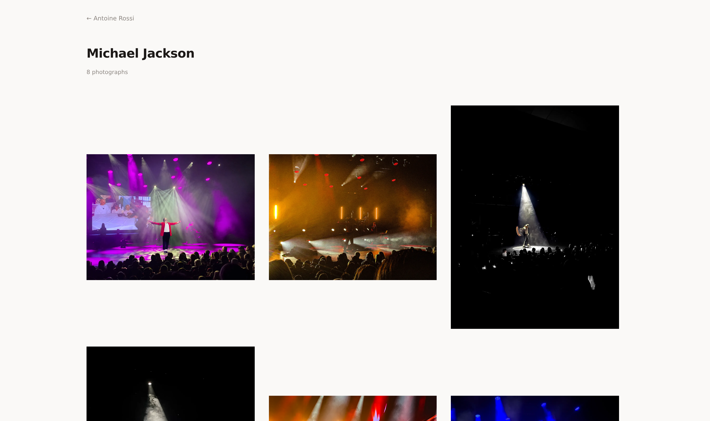

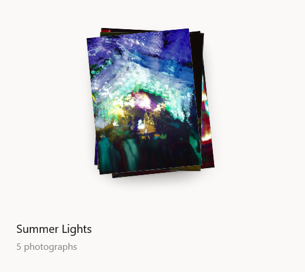 &nbsp; 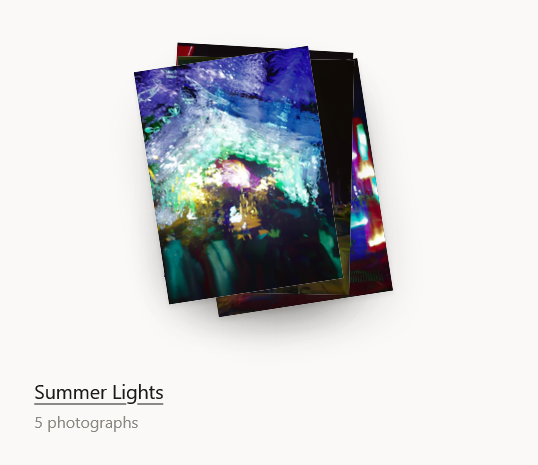

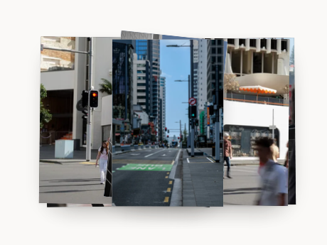 &nbsp; 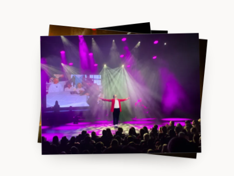

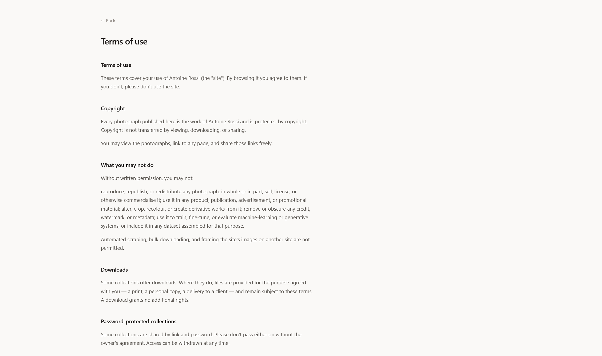 &nbsp; 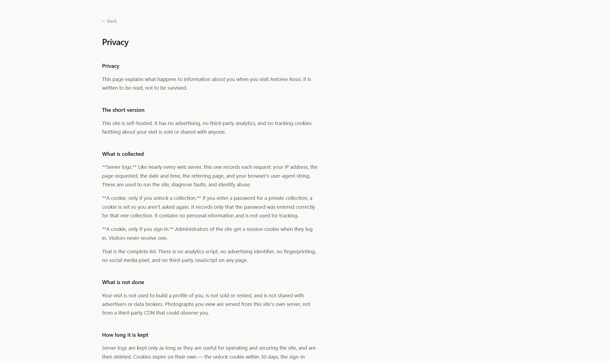

</details>

## Contributing

Issues and pull requests are welcome. Please run `npm run lint` and `npm run check` before opening one, and add tests for behaviour that isn't obvious from reading the code.

## License

[MIT](LICENSE) © Antoine Rossi

Animation uses [GSAP](https://gsap.com), which is free for commercial and open source use under its own [standard license](https://gsap.com/community/standard-license/) — free, but not an OSI-approved license, which is worth knowing if you fork this.
